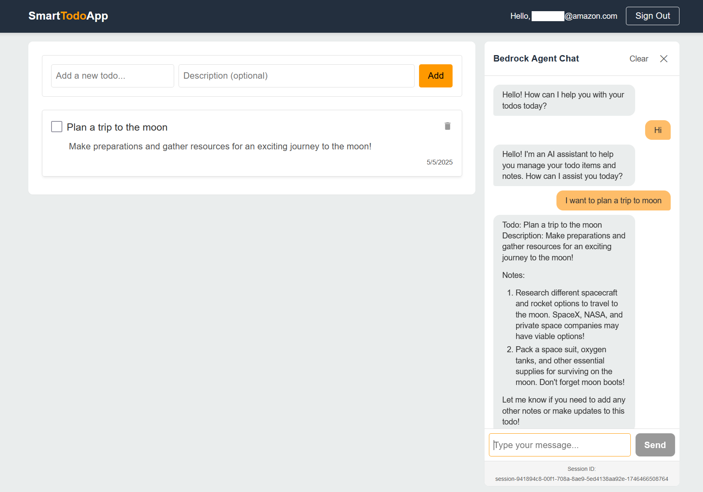

# Bringing Generative AI to Existing Apps: Empowering Bedrock Agents to Take Secure Actions on Your Existing APIs


Generative AI is driving innovation across industries by enabling organizations to enhance user experiences, automate complex tasks, and gain deeper insights from unstructured data. Amazon Bedrock is a fully managed service that enables organizations to build generative AI applications with built-in security, privacy, and responsible AI capabilities. Through Agents for Amazon Bedrock, developers can create AI applications that complete complex tasks and deliver up-to-date answers based on proprietary knowledge sources without manual coding.

At the same time, many enterprises have stringent compliance requirements and established security architectures. Companies typically have existing APIs defined to work within specific scopes of user requests, with authorization mechanisms already in place, and may not be willing to alter these APIs to allow wider access for agentic workflows. This blog post explains how a proxy-based approach can integrate Bedrock Agents with existing systems while meeting specialized security or governance needs.

## Benefits of Adding Generative AI Agentic Flows to Existing Applications

Many organizations maintain a backlog of usability features that would enhance their applications but are rarely prioritized due to the effort required to build and maintain them within traditional UI constraints. These features often require complex workflows spanning multiple API calls, contextual understanding of user intent, or sophisticated data processing—all of which can be challenging to implement in conventional interfaces.

By integrating generative AI through Bedrock Agents with existing applications, organizations can implement these usability features as agentic tasks without significant modifications to core systems:

- **Complex Multi-Step Workflows**: Agents can orchestrate sequences of API calls that would otherwise require multiple user interactions, reducing friction and improving completion rates.

- **Natural Language Interfaces**: Users can express their intent in natural language, and agents can translate these requests into the appropriate API calls, making advanced features accessible to non-technical users.

- **Contextual Assistance**: Agents can provide guidance and suggestions based on user history and application state, creating a more intuitive experience without rebuilding the UI.

- **Data Synthesis and Summarization**: Agents can aggregate information from multiple endpoints and present concise, actionable summaries that would be difficult to display in traditional interfaces.

- **Personalized Experiences**: By understanding user preferences and patterns, agents can customize interactions and recommendations without requiring extensive UI customization options.

These capabilities allow organizations to unlock value from their existing APIs and data sources while minimizing changes to core systems. Rather than rebuilding applications to accommodate new features, Bedrock Agents can serve as an intelligent layer that enhances usability while respecting the established security boundaries and authorization mechanisms.

## The Customer Need: Secure Integration with Existing Applications

Customers are increasingly looking to enhance their applications with generative AI by using Amazon Bedrock Agents. Many of these customers already have robust internal APIs, authentication workflows, and comprehensive permission models. Rather than expanding existing permissions or rewriting core services, customers want to connect Bedrock Agents to these internal APIs in a way that respects governance rules and preserves compliance boundaries. 

## Solution Overview

To address the challenge of securely integrating Bedrock Agents with existing APIs, we propose a proxy-based architecture that maintains security boundaries while enabling AI-driven interactions. This solution:

1. **Preserves Existing Authorization Models**: Uses short-lived, encrypted tokens to maintain the integrity of established authorization mechanisms
2. **Implements Vertical Slice Architecture**: Adds a dedicated `/chat` endpoint to existing APIs as a vertical slice, allowing agentic workflows without modifying core API functionality
3. **Leverages Bedrock Agent Memory**: Utilizes Bedrock's built-in memory management capabilities to maintain conversation context across multiple interactions
4. **Minimizes Attack Surface**: Implements a principle of least privilege approach where the AI layer never directly handles credentials
5. **Maintains Audit Trails**: Leverages AWS services like KMS and CloudTrail to provide comprehensive logging of all authorization activities
6. **Supports Compliance Requirements**: Aligns with common regulatory frameworks by keeping sensitive data encrypted and ephemeral
7. **Enables Seamless Integration**: Allows organizations to add generative AI capabilities without modifying existing API security models

The solution consists of a token management system, a proxy Lambda function, and a configuration approach for Bedrock Agents that together create a secure bridge between AI capabilities and existing application APIs. By implementing the chat interface as a vertical slice, organizations can introduce generative AI capabilities as an add-on while maintaining the integrity of their existing systems.


### Establishing a Secure Proxy Boundary

A dedicated AWS Lambda function—often referred to as a "proxy Lambda"—can facilitate communication between Amazon Bedrock Agents and existing APIs. This approach provides additional separation of concerns while maintaining the principle of least privilege. When a Bedrock Agent needs to perform an action that requires authorization, the agent calls the proxy Lambda with a reference (such as a token ID). The proxy Lambda retrieves the corresponding token from short-lived storage and attaches it to the downstream API request. By design, the Bedrock Agent does not handle user credentials directly. This pattern is not about distrusting Bedrock; rather, it supports specific compliance and operational controls that some customers have in place.

### Architecture Overview


The diagram above shows how multiple AWS services interact:

- **React Frontend** for user interactions  
- **API Gateway & Express Lambda** as an existing backend API  
- **Amazon DynamoDB** for data storage and short-lived token storage  
- **Amazon Bedrock Agents** configured with an OpenAPI schema and action groups  
- **Proxy Lambda** that manages token encryption/decryption and passes authorization tokens to the backend  
- **AWS KMS** that encrypts tokens and ensures logs for every encryption and decryption operation  

### How the Authentication Flow Works


When a user sends request to /Chat endpoint, the authentication token is immediately encrypted using AWS KMS and stored in Amazon DynamoDB with a brief time-to-live (TTL), ensuring that the record is deleted even if there are any transient errors. Instead of sharing raw credentials with the Bedrock Agent, the system provides only token ID reference. When the Bedrock Agent needs to call the existing API, it passes the token ID to the proxy Lambda. The proxy Lambda retrieves and decrypts the token from DynamoDB, attaches the credentials to the backend API request and returns response to Bedrock Agent. When the Chat Api receives the response from Bedrock Agent, it then deletes the token record in DynamoDB. This design ensures that credentials are short-lived and remain controlled by the proxy's limited IAM permissions—rather than by the AI layer itself. 

### Implementation Highlights

A reference implementation of this approach can be found in the [Smart Todo App GitHub Repository](https://gitlab.aws.dev/heymanu/AmazonQDeveloperVibeCodingSamples/-/tree/main/BedrockAgentsProxy?ref_type=heads). This example demonstrates how to configure each component:

- **Proxy Lambda** receives only minimal privileges to query DynamoDB and decrypt tokens via AWS KMS.  
- **Bedrock Agent** is configured with an OpenAPI schema and action groups to specify how it can interact with the backend.  
- **DynamoDB** stores tokens with a configured TTL, ensuring they automatically expire if not actively used.  
- **AWS KMS** provides centralized key management and encryption for protecting sensitive data, such as tokens, at rest. All cryptographic operations using KMS are automatically loged to AWS CloudTrail, supporting audit and compliance needs.

## Leveraging OpenAPI for Bedrock Agent Integration

The OpenAPI schema plays a crucial role in enabling Bedrock Agents to interact effectively with existing APIs. This section explores how OpenAPI configuration specifically empowers the integration.

### Open API as the Contract Between the Bedrock Agents and the existing API

The OpenAPI schema defines how Bedrock Agents interact with existing APIs. It enables agents to select the right API operation, validate parameters, and enforce request structure. Proxy Lambda uses the same schema to map requests and responses between the agent and the backend. This ensures consistent, schema-aligned communication across components.


### Designing OpenAPI Schemas for Bedrock Agents

When designing OpenAPI schemas for Bedrock Agents, certain practices enhance the agent's ability to interpret and use an API effectively:

1. **Descriptive Operation IDs**: Clear, action-oriented operation IDs like `getResourceList`, `createResource`, and `updateResource` help the agent understand the purpose of each endpoint.

2. **Detailed Parameter Descriptions**: Comprehensive descriptions of parameters guide the agent in selecting appropriate values based on user intent.

3. **Structured Response Models**: Well-defined response schemas enable the agent to extract and present relevant information to users.

4. **Consistent Naming Conventions**: Using consistent naming patterns across endpoints helps the agent recognize relationships between resources and operations.

5. **Semantic Operation IDs**: Choose operation IDs that clearly convey the action and resource (e.g., `createResource` rather than `postNew`).

6. **Example Values**: Include example values in the schema to guide the agent in parameter selection.

7. **Consistent Response Structures**: Maintain consistent patterns in response objects to simplify agent interpretation.

8. **Error Response Documentation**: Clearly define possible error responses to help the agent handle and explain failures.

9. **Intuitive Path Design**: Keep URL paths intuitive and hierarchical to simplify agent understanding.

By designing an OpenAPI schema with these considerations in mind, it's possible to create a more effective bridge between natural language user intents and existing API capabilities.

### From User Intent to API Calls

The OpenAPI schema enables Bedrock Agents to translate natural language user requests into precise API calls:


### Schema Evolution

As an API evolves, the OpenAPI schema provides a structured way to manage changes while maintaining compatibility with Bedrock Agents. The API schema acts as a reference document that defines all available operations, and deployment of the solution with an updated schema file is all that's needed to allow incremental updates. When new endpoints or optional parameters are added to the API, simply updating the OpenAPI schema enables the Bedrock Agent to understand and utilize these new capabilities without requiring additional code. This approach eliminates the need to write additional code for every new API operation, significantly reducing development effort and accelerating the integration of new features.

### Security and Compliance Benefits

Using a proxy-based integration pattern can simplify governance reviews and strengthen security. First, credentials remain encrypted with AWS KMS key until the exact moment they are needed. The Bedrock Agent itself works with a token reference, rather than raw credentials, satisfying many customer's policy requirements for avoiding direct AI access to sensitive data. Additionally, DynamoDB's TTL feature reduces the lifespan of stored tokens, limiting potential exposure in event of transient failures at API layer. Finally, because KMS logs all operations in AWS CloudTrail, this pattern provides a clear audit trail that supports investigations, compliance checks, and internal governance.

## Deploying the solution
### Prerequisites
- AWS Account with appropriate permissions
- AWS CLI configured with credentials
- Node.js >= 20.x and npm installed
- AWS CDK CLI installed globally (`npm install -g aws-cdk`)

### Deployment Steps

1. Clone the repository:
```bash
git clone https://gitlab.aws.dev/heymanu/AmazonQDeveloperVibeCodingSamples
cd BedrockAgentsProxy
```

2. For first-time deployment, use the automated script:
```bash
npm run deploy:first-time
```

This script will:
- Install all dependencies
- Build all components
- Deploy the infrastructure
- Update environment variables with Cognito settings
- Rebuild with updated environment variables
- Deploy the final infrastructure

3. For subsequent deployments:
```bash
npm run deploy
```


### Verifying Deployment
After deployment completes:

1. Access the CloudFront URL provided in the CDK outputs

2. Create a new user by signing up using the "Create Account" section. Please use an active email address to receive a user verification email.

3. Test the chat functionality to verify the Bedrock Agent integration


## Best Practices

Additional best practices can further optimize this approach:
  
- **Monitor Token Usage**: Enable detailed logging and set up alarms for unusual patterns, such as repeated decryption attempts or decryption of data from other AWS resources apart from Proxy Lambda.  
- **Validate Requests**: Enforce schema validation on both inbound and outbound data to handle potential edge cases from AI-generated content.  
- **Review IAM Policies Regularly**: Keep the proxy Lambda restricted to "get item" and "decrypt" privileges; adjust roles or scopes as organizational policies evolve.  


## Conclusion

A proxy-based architecture provides a straightforward and secure method of integrating Amazon Bedrock Agents with existing APIs. By design, it does not imply mistrust of the Bedrock service; instead, it addresses specific compliance and governance requirements many customers follow for mission-critical workflows. The approach encrypts and stores tokens in DynamoDB, decrypts them via AWS KMS, and scopes access to a minimal set of actions—thereby adhering to least privilege principles.

### Call to Action

Review the Sample repository to see how Bedrock Agents can be securely integrated with your existing APIs using a proxy-based approach. This reference implementation shows how to add intelligent agent capabilities without compromising existing security models or rewriting core services.
Start by deploying the vertical slice, validate agent behavior using your own APIs behind a proxy, and experiment with schema evolution to unlock new agentic tasks—all while preserving compliance boundaries. 
 For additional guidance or to share experiences, consider visiting [AWS re:Post](https://repost.aws) or contacting an AWS account team.
