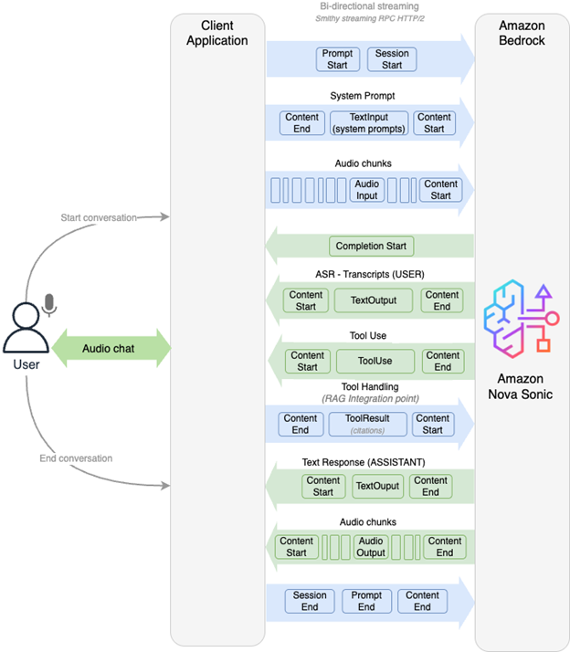
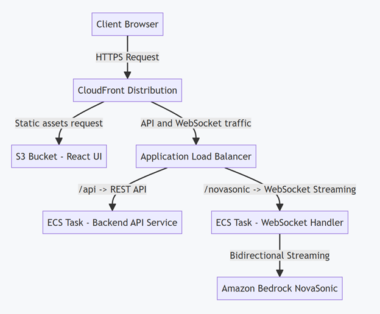
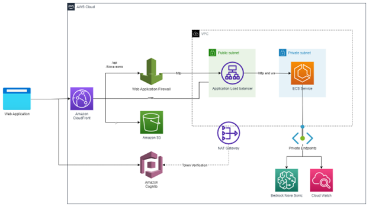
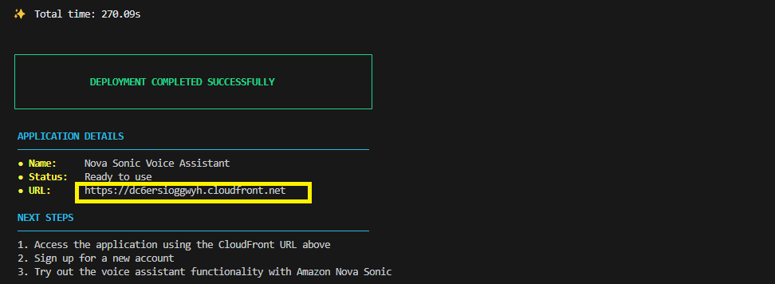
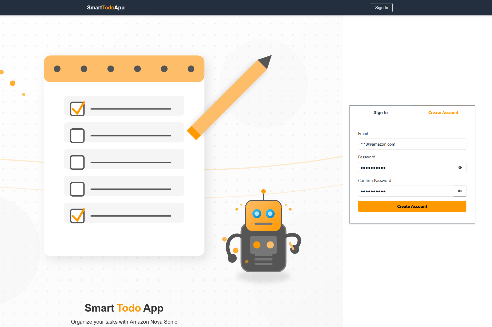
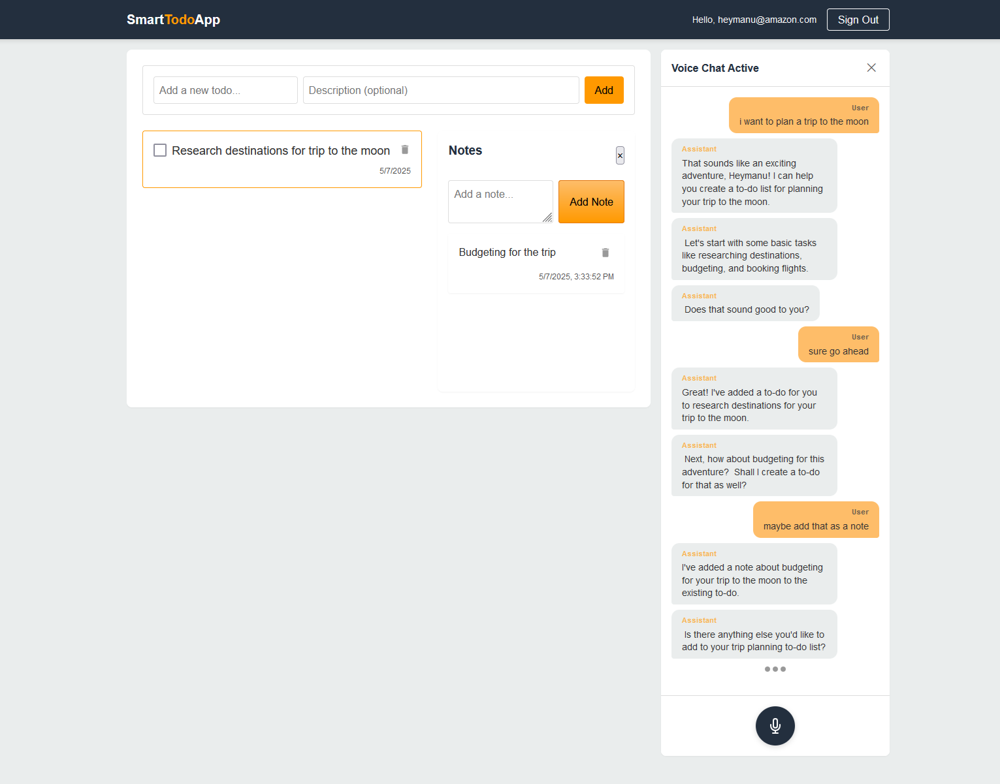

# From Clicks to Conversations: Make Your

# Web Apps Hands-Free with Amazon

# NovaSonic

**Introduction**

Amazon NovaSonic is a state-of-the-art foundation model from Amazon Bedrock that
enables real-time, natural, human-like speech-to-speech interactions through unified
speech understanding and generation. It offers bidirectional streaming, allowing
developers to build low-latency, contextually aware voice interfaces. With capabilities like
adaptive speech response, multi-turn conversation support, tool use, Retrieval-Augmented
Generation (RAG), and robustness to interruptions and background noise, NovaSonic is
engineered for immersive, production-grade voice applications.

In this blog, you'll learn how to integrate Amazon NovaSonic into a web-based application
using a real-world example: the Smart Todo App. It explains how NovaSonic can be used to
create a voice-native user experience and outlines the infrastructure required to support
bidirectional streaming for natural conversations. The sample code repository includes
deployable artifacts—such as infrastructure-as-code templates and service
configurations—that developers can use to stand up their own environment and test the
integration end-to-end.

Smart Todo App demonstrates how voice interactions can be embedded into a web
experience to enable natural conversations with an intelligent assistant. From audio
streaming and contextual conversation flow to task management and backend tool
invocation, the integration illustrates how voice can power meaningful productivity features
in a focused application.

**Rethinking User Interaction Through Voice**

Important usability enhancements are often deprioritized—not because they aren't
valuable, but because they're difficult to implement within traditional mouse-and-keyboard
interfaces. Features like intelligent batch actions, personalized workflows, or voice-guided
assistance are frequently debated but deferred due to UI complexity.

Voice interfaces change that dynamic. Adding a voice-based AI agent opens up a
completely new dimension of user interaction. It not only enables hands-free operation but


also empowers users to augment their workflows. With NovaSonic, users can speak
natural language commands—"Organize my week" or "Remind me to call Sarah tomorrow
morning"—and the assistant performs multi-step, intelligent operations on their behalf.

This creates an environment where productivity is multiplied, and context becomes the
interface. It's not about replacing traditional UI—it’s about unlocking new capabilities
through voice.

**Building the Experience: A Walkthrough**

Smart Todo App allows users to create todo lists and manage notes within those lists,
offering a focused yet flexible interface for task tracking and note organization. With the
addition of voice, it becomes a hands-free experience that unlocks more natural and
productive interactions.

**Audio at the Core**

Using the Web Audio API on the frontend, microphone input is captured live and streamed
through a WebSocket to the backend. The frontend is a React-based single-page
application hosted on Amazon S3 and served through Amazon CloudFront. CloudFront
routes all traffic: requests to / serve the static UI from S3, while /api and /novasonic paths
are forwarded to an Application Load Balancer (ALB) that routes them to containerized
Web APIs running on ECS Fargate. The WebSocket connection and voice streaming
pipeline forward the audio to Amazon Bedrock using the
InvokeModelWithBidirectionalStream API, and responses are decoded and played in real
time on the client.

**Conversations With Context**

When a user says, "What are my tasks?" the assistant responds with a concise list. The
conversation doesn’t stop there. If the user follows up with, "Move the third one
completed," the assistant understands—thanks to NovaSonic’s ability to track and reason
over prior interactions.

This is enabled by the session architecture, which maintains session context in memory
during active WebSocket connections, orchestrated by the session manager in the
backend. Application data such as todo lists and notes are stored separately in
DynamoDB.

**Voice Meets Business Logic**


NovaSonic interprets user speech, understands intent, and calls registered tools. These
tools—such as createNote, getTodos, or updateTaskStatus—map directly to Smart Todo
App’s existing API endpoints.

**Real Features, Real Flow**

In Smart Todo App, users can say:

- "Add a note to follow up on the project charter."
- "Mark all completed notes from last week as done."

Behind each command are focused actions—like creating a new note, organizing content,
or updating task status—executed through speech in a way that feels natural and efficient.

This is not just voice input—it’s voice-driven intelligence.

**Designing the Prompt, Not Just the Interface**

Smart Todo App generates prompts dynamically at runtime, tailored to the available tools
and current user session. The dynamic system prompt not only guides the assistant’s tone
and response style but also informs it of available tool capabilities—such as what tools it
can call and the parameters each expects.

The prompt includes tone guidelines to keep responses friendly and concise, and it can
personalize the experience by incorporating the user's name. If tools are registered, their
names, descriptions, and expected input parameters are enumerated in the prompt so the
assistant can reason about them appropriately.

This approach ensures the assistant adapts to each session context in real time—
remaining both responsive and informed.

**How NovaSonic Bidirectional APIs Work**

NovaSonic implements a real-time bidirectional streaming architecture. Once a session is
initiated with InvokeModelWithBidirectionalStream, audio input and model responses flow
simultaneously over an open stream:

- **Session Start** : Client sends a sessionStart event with model configuration (e.g.,
    temperature, topP).
- **Prompt and Content Start** : Client sends structured events indicating whether
    upcoming data is audio, text, or tool input.
- **Audio Streaming** : Microphone audio is streamed as base64-encoded audioInput
    events.


- **Model Responses** : As the model processes input, it streams responses
    asynchronously:
       o Automatic speech recognition (ASR) results
       o Tool use invocations
       o Text responses
       o Audio output for playback
- **Session Close** : Conversations are explicitly closed by sending contentEnd,
    promptEnd, and sessionEnd events.
    


This event-driven approach allows users to interrupt the assistant (barge-in), enables
multi-turn conversations, and supports real-time adaptability.

**Implementing Bidirectional Architecture with CloudFront, ALB, and ECS**

To deliver NovaSonic bidirectional experiences at scale, Smart Todo App uses a specialized
AWS deployment pattern:


- **CloudFront** : Handles HTTPS traffic termination at the edge and routes user traffic to
    the Application Load Balancer (ALB).
- **Application Load Balancer (ALB)** : Supports WebSocket protocol upgrades and
    routes:
       o /api paths to backend ECS services for HTTPS REST APIs.
       o /novasonic paths to ECS services handling WebSocket streaming to Bedrock
          NovaSonic.
- **ECS Fargate Services** : Containerized services in private subnets manage:
    o WebSocket event handling
    o Real-time audio processing
    o Connection orchestration with Amazon Bedrock

This design ensures minimal latency, high availability, and scalability for thousands of
concurrent voice sessions.




**Solution Architecture**

Smart Todo App is deployed using a scalable and secure AWS architecture designed to
support real-time voice interactions.


Key components include:

- **Amazon VPC** : Provides network isolation and security for backend services.
- **Public Subnets** : Host the Application Load Balancer (ALB).
- **Private Subnets** : Host ECS Fargate tasks running WebSocket and REST APIs.
- **NAT Gateway** : Allows ECS tasks in private subnets to securely connect to the
    internet for operations like Cognito JWT token verification endpoints.
- **Amazon S3** : Hosts the React-based single-page application.
- **Amazon CloudFront** : Distributes the application globally with low latency. It routes
    / traffic to the S3 bucket and /api and /novasonic traffic to the backend services.
- **AWS WAF** : Protects the Application Load Balancer (ALB) from malicious traffic and
    enforces security rules at the application layer.
- **Application Load Balancer (ALB)** : Forwards /api (HTTPS REST API calls) to backend
    ECS services handling Smart Todo App APIs, and /novasonic (WebSocket
    connections) to ECS services managing real-time voice streaming with Amazon
    Bedrock NovaSonic.
- **Amazon ECS (Fargate)** : Runs the backend containerized services for WebSocket
    handling and REST APIs.


- **Amazon Cognito** : Manages authentication and issues tokens.
- **Amazon Bedrock** : Powers real-time, bidirectional speech interactions through the
    NovaSonic model.
- **Amazon CloudWatch** : Collects application logs and telemetry data for monitoring
    and observability.
- **Amazon DynamoDB** : Stores application data such as todo lists and notes.

This design ensures low-latency streaming, secure session management, and scalable
compute for multi-user scenarios.

## Deploying the solution
### Prerequisites
- AWS Account with appropriate permissions
- Ability to build docker images locally using Docker CLI
- AWS CLI configured with credentials
- Node.js >= 20.x and npm installed
- AWS CDK CLI installed globally (`npm install -g aws-cdk`)

### Deployment Steps

1. Clone the repository:
```bash
git clone https://github.com/aws-samples/sample-amazon-q-developer-vibe-coded-projects.git
cd NovaSonicVoiceAssistant
```

2. For first-time deployment, use the automated script:
```bash
npm run deploy:first-time
```

This script will:
- Install all dependencies
- Build all components
- Builds a local docker image to be uploaded to ECR repository
- Deploy the infrastructure
- Update environment variables with Cognito settings
- Rebuild with updated environment variables
- Deploy the final infrastructure


3. For subsequent deployments:
```bash
npm run deploy
```
### Verifying Deployment
After deployment completes:

1. Access the CloudFront URL provided in the CDK outputs

2. Create a new user by signing up using the "Create Account" section. Please use an active email address to receive a user verification email.

3. Test the chat functionality to verify the Bedrock Agent integration


**Call to Action**

Voice is no longer a future trend—it is already transforming how users interact with
applications today. Amazon Bedrock’s NovaSonic empowers developers to deliver
responsive, human-like conversations powered by real-time speech and intelligent
orchestration.

Start by exploring the code base in the sample github repository, deploy the solution in your AWS
environment, and experiment with integrating voice-native capabilities into your own
applications. Whether you're building productivity tools, customer support systems, or
next-generation user interfaces, NovaSonic provides the foundation to make it possible.

Make your applications voice-aware. Bring them to life with Amazon Nova Sonic.
For additional guidance or to share experiences, consider visiting [AWS re:Post](https://repost.aws) or contacting an AWS account team.


