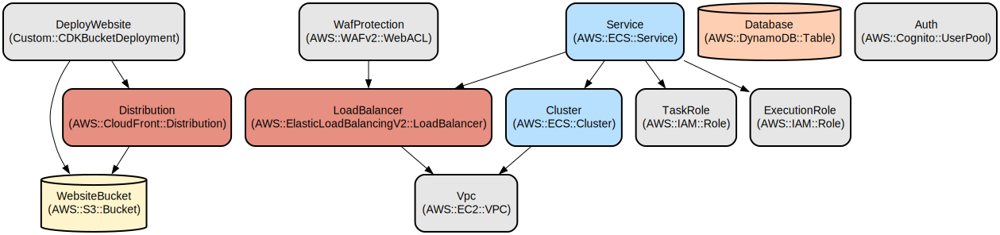

# Smart Todo App: A Voice-Enabled Task Management System with AI Integration

Smart Todo App is a modern, cloud-native task management application that combines traditional todo functionality with AI-powered voice interactions. The application enables users to manage their tasks through both a web interface and natural language voice commands, making task management more intuitive and accessible.

The application is built using a microservices architecture deployed on AWS, featuring a React-based frontend, Node.js/Express backend, and leverages AWS services including Cognito for authentication, DynamoDB for data storage, and Amazon Bedrock for AI capabilities. The voice interaction feature allows users to create, update, and manage tasks using natural speech, while the traditional web interface provides a familiar and efficient way to organize tasks.

## Repository Structure
```
.
├── api/                      # Backend API service with Express.js and TypeScript
│   ├── src/                 # Source code for the API
│   │   ├── controllers/     # Request handlers for different routes
│   │   ├── middleware/      # Express middleware (auth, logging, error handling)
│   │   ├── services/       # Business logic and external service integrations
│   │   └── tools/          # AI tool implementations for task management
├── infra/                   # AWS CDK infrastructure code
│   ├── lib/                 # Infrastructure constructs
│   │   ├── constructs/     # Reusable CDK constructs for AWS services
│   │   └── smart-todo-stack.ts  # Main stack definition
├── ui/                      # React frontend application
│   ├── src/                 # Source code for the UI
│   │   ├── components/     # React components
│   │   ├── context/        # React context providers
│   │   └── services/       # API integration services
└── scripts/                 # Deployment and utility scripts
```

## Usage Instructions
### Prerequisites
- Node.js >= 20.0.0
- AWS CLI configured with appropriate credentials
- AWS CDK CLI installed globally (`npm install -g aws-cdk`)
- Docker installed and running (for local development)

### Installation

1. Clone the repository and install dependencies:
```bash
git clone <repository-url>
cd smart-todo-app
npm run installall
```

2. First-time deployment:
```bash
npm run deploy:first-time
```

### Quick Start
1. Access the application URL provided in the deployment outputs
2. Log in using the Cognito authentication system
3. Create a new todo by typing in the input field or using the voice command button
4. Manage your todos through the web interface or voice commands

### More Detailed Examples

**Creating a Todo with Voice**
1. Click the chat button (💬) in the bottom right corner
2. Click the microphone icon to start voice input
3. Say "Create a new todo to buy groceries for tomorrow"
4. The AI will process your request and create the todo

**Managing Todos via Web Interface**
```typescript
// Create a new todo
const todo = await todoApi.createTodo({
  title: "Buy groceries",
  description: "Get milk, eggs, and bread",
  completed: false
});

// Mark todo as complete
await todoApi.updateTodo(todo.id, { completed: true });
```

### Troubleshooting

**Common Issues**

1. Deployment Failures
- Error: "Resource limit exceeded"
  - Solution: Check AWS account limits and request increases if needed
  - Verify VPC resource availability in the target region

2. Authentication Issues
- Error: "User pool configuration error"
  - Check Cognito configuration in the AWS Console
  - Verify environment variables are properly set
  - Clear browser cache and try again

3. Voice Recognition Problems
- Issue: Microphone not working
  - Ensure browser permissions are granted
  - Check browser compatibility (Chrome/Firefox recommended)
  - Verify SSL certificate is valid for HTTPS

## Data Flow
The application follows a standard client-server architecture with additional AI integration for voice processing.

```ascii
User Input (Web/Voice) --> React Frontend --> Express API --> DynamoDB
                              ↑                    ↓
                              └── Amazon Bedrock ──┘
```

Key Component Interactions:
1. Frontend communicates with backend via REST API and WebSocket
2. Authentication handled by AWS Cognito
3. Todo data stored in DynamoDB with optimistic locking
4. Voice input processed through WebSocket connection
5. AI processing handled by Amazon Bedrock
6. Real-time updates via WebSocket events
7. CloudFront distribution handles static content and API proxying

## Infrastructure

### Architecture Overview

The Smart Todo application uses a serverless architecture leveraging multiple AWS services. The frontend is hosted in S3 and distributed through CloudFront. Authentication is handled by Amazon Cognito. The backend runs on ECS Fargate, storing data in DynamoDB and using Amazon Bedrock for AI capabilities. CloudFront acts as the main entry point, routing requests to either S3 for static content or the ECS service for API calls.



### Authentication (Cognito)
- User Pool: Manages user authentication and authorization
- User Pool Client: Handles OAuth2 flows
- Hosted UI: Provides login/signup interface

### Storage (DynamoDB)
- TodoTable: Stores todo items and associated notes
- Partition Key: userId
- Sort Key: id (todo/note identifier)

### API (ECS Fargate)
- ECS Cluster: Runs containerized API service
- Application Load Balancer: Routes traffic to containers
- VPC Endpoints: Enables private AWS service access
- WAF Protection: Provides web application firewall security

### Frontend (CloudFront + S3)
- S3 Bucket: Hosts static web assets
- CloudFront Distribution: Delivers content and proxies API requests
- WAF Rules: Protects against common web vulnerabilities

## Deployment

### Prerequisites
- AWS Account with appropriate permissions
- AWS CLI configured
- Node.js and npm installed
- Docker installed

### Deployment Steps
1. Install dependencies:
```bash
npm run installall
```

2. Build all components:
```bash
npm run build
```

3. Deploy infrastructure:
```bash
npm run deploy:first-time
```

4. Update environment variables:
```bash
npm run update-env
```

5. Monitor deployment:
- Check CloudFormation console for stack status
- Verify resource creation in AWS Console
- Test application endpoints